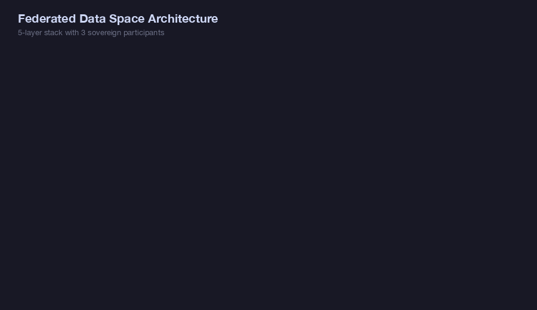
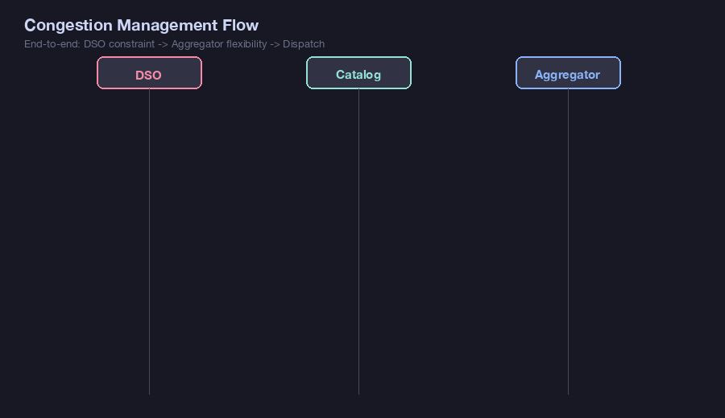
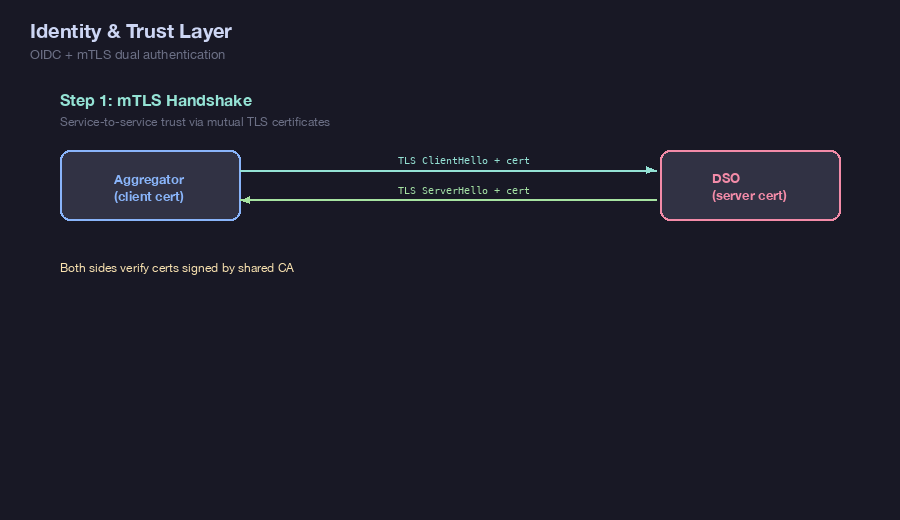
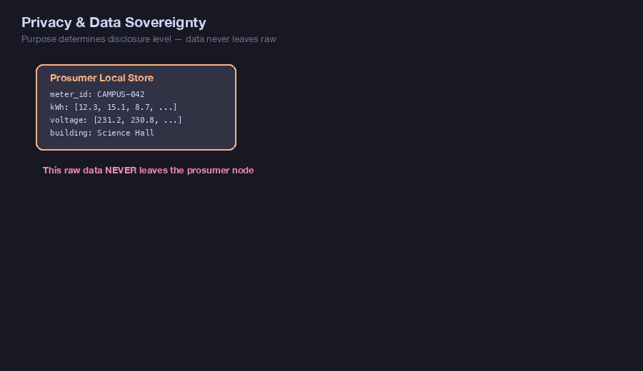
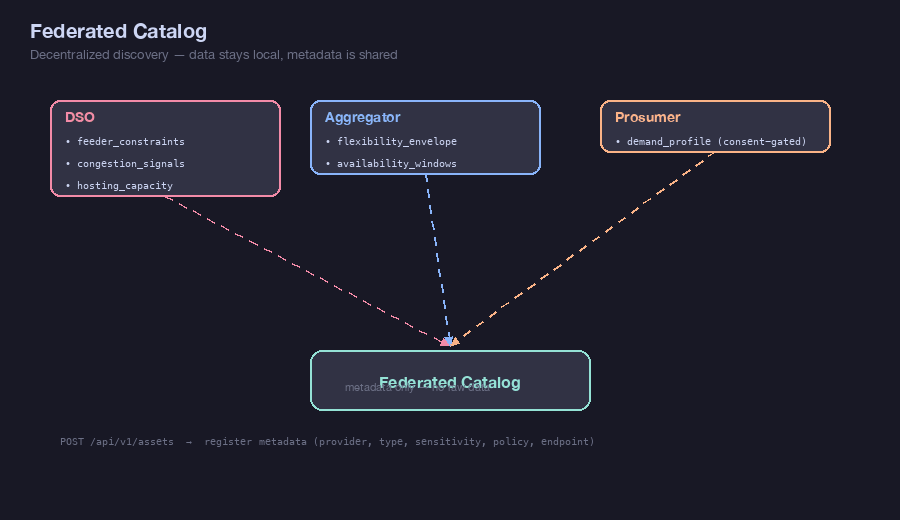
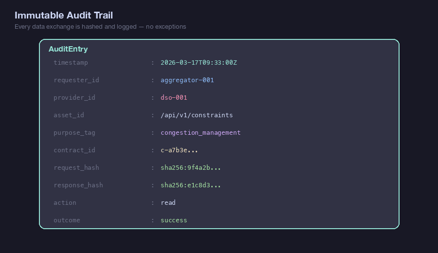
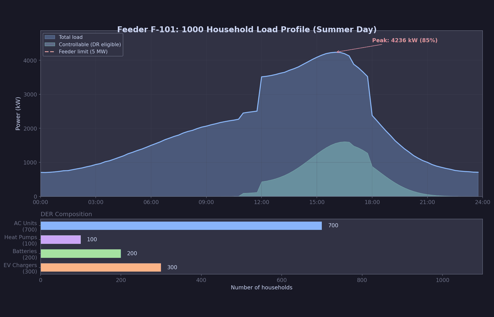
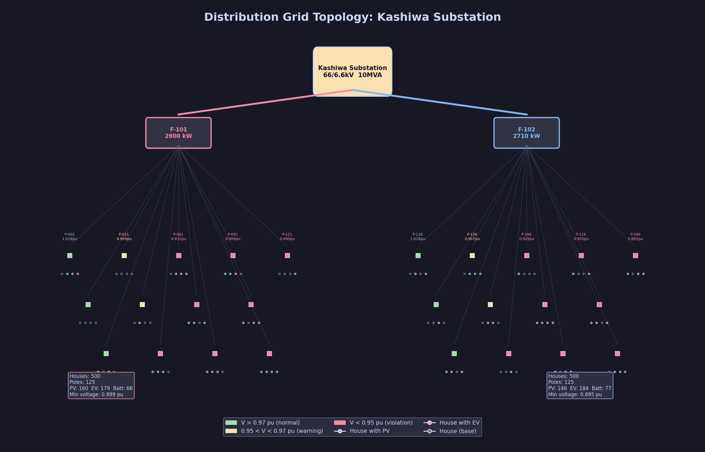

# Data Space Grid

Federated Data Space research prototype for the electricity sector. Each participant retains local data ownership while sharing metadata, contracts, and control signals through a trust-mediated connector architecture.

**[Live Demo](https://lutelute.github.io/data-space-grid/)** | **[Presentation (14 slides)](https://lutelute.github.io/data-space-grid/presentation.html)** | **[日本語解説書 (20章)](docs/GUIDE_JA.md)**

## Architecture



The system implements a 5-layer stack with 3 sovereign participants (DSO, Aggregator, Prosumer). Each node wraps all data exchanges with a shared **Data Space Connector** that enforces authentication, policy, and audit on every request.

## Congestion Management — End-to-End Flow



The primary use case: DSO publishes feeder constraints, Aggregator discovers and negotiates a contract, reads constraints, submits flexibility offers, receives dispatch commands via Kafka, and reports actuals. Every step is recorded in an immutable audit trail.

## Contract Negotiation


No data exchange without an **ACTIVE** contract. Contracts follow a state machine (OFFERED -> NEGOTIATING -> ACTIVE) with terminal states (EXPIRED, REVOKED, REJECTED). Each contract specifies purpose constraints, retention limits, redistribution rules, and emergency override flags.

## Identity & Trust



Dual authentication: **mTLS** for service-to-service trust (both sides verify certificates signed by a shared CA) and **OIDC** via Keycloak for user/org identity. JWT tokens are validated locally using cached JWK keys — no per-request introspection.

## Privacy & Data Sovereignty



Consumer data is never shared raw. The **purpose** of the request determines the disclosure level: `research` gets only statistical aggregates, `dr_dispatch` gets only controllable margin, `billing` requires explicit consent. k-anonymity guarantees prevent individual identification. Consent revocation is immediate.

## Federated Catalog



Decentralized discovery: each participant registers data asset **metadata** (provider, type, sensitivity, policy, endpoint) to the catalog. Actual data stays local. Other participants search and discover assets, then negotiate contracts before accessing data.

## Audit Trail



Every data exchange produces an immutable audit entry with SHA-256 hashes of both request and response bodies, purpose tag, timestamp, requester identity, and contract reference. Audit is synchronous and non-optional — failing to audit = failing the request.

---

## Live Demos

### 1000-Household Congestion Management

Full role-playing scenario: DSO detects congestion, Aggregator negotiates contract, dispatches DR from 1000 households (EV/battery/AC/heat pump), spy gets blocked, prosumer revokes consent, DSO uses emergency override.


**Visualization output:**



### Grid Topology & Power Flow

250 poles (4 houses each) on 2 feeders, simplified DistFlow voltage calculation, 162 voltage violations detected, DR dispatch via federated data space reduces violations.


**Visualization output:**



Run the demos yourself:

```bash
.venv/bin/python examples/congestion_management_demo.py  # 9 charts in examples/output/
.venv/bin/python examples/grid_topology_demo.py          # 4 charts in examples/output/
```

---

## Test Suite

322 tests (226 unit + 96 integration) covering all layers:

<details>
<summary>Unit Tests (226 passed)</summary>


</details>

<details>
<summary>Integration Tests (96 passed)</summary>


</details>

<details>
<summary>Contract Negotiation Tests</summary>


</details>

<details>
<summary>Congestion Management E2E Tests</summary>


</details>

<details>
<summary>Auth Flow Tests</summary>


</details>

<details>
<summary>Audit Trail Tests</summary>


</details>

<details>
<summary>Catalog Flow Tests</summary>


</details>

<details>
<summary>Anonymizer Tests</summary>


</details>

<details>
<summary>Semantic Models Tests</summary>


</details>

<details>
<summary>Policy Engine Tests</summary>


</details>

---

## Tech Stack

- **Language**: Python 3.11+
- **Framework**: FastAPI + Uvicorn
- **Auth**: Keycloak 26.x (OIDC) + mTLS
- **Event Bus**: Apache Kafka (KRaft mode)
- **Database**: SQLite (dev) / PostgreSQL (prod)
- **Models**: Pydantic v2
- **Orchestration**: Docker Compose

## Project Structure

```
src/
├── connector/          # Reusable Data Space Connector library
│   ├── models.py       #   Core models (Participant, Contract, Policy, AuditEntry)
│   ├── contract.py     #   Contract negotiation state machine
│   ├── policy.py       #   Policy enforcement engine
│   ├── auth.py         #   OIDC token validation + mTLS
│   ├── audit.py        #   Immutable audit logger
│   ├── middleware.py    #   FastAPI middleware (auth + policy + audit)
│   ├── catalog_client.py  # Federated catalog client
│   └── events.py       #   Kafka producer/consumer wrapper
├── semantic/           # Industry-standard data models
│   ├── cim.py          #   CIM grid topology (Feeder, Constraint, HostingCapacity)
│   ├── iec61850.py     #   DER flexibility (FlexibilityEnvelope, PQRange)
│   ├── openadr.py      #   DR events (DREvent, Signal, Baseline)
│   └── consumer.py     #   Consumer data (DemandProfile, ConsentRecord)
├── catalog/            # Federated Catalog service
│   ├── main.py, routes.py, store.py, schemas.py
└── participants/
    ├── dso/            # DSO participant node
    ├── aggregator/     # Aggregator participant node
    └── prosumer/       # Prosumer participant node
infrastructure/
├── keycloak/           # Realm configuration
├── kafka/              # Topic initialization
└── certs/              # Dev certificate generation
tests/
├── unit/               # 6 unit test modules
└── integration/        # 5 integration test modules
```

## Quick Start

### Prerequisites

- Python 3.11+
- Docker & Docker Compose

### Setup

```bash
# Create virtual environment and install dependencies
make setup
source .venv/bin/activate

# Generate dev certificates for mTLS
make certs

# Start infrastructure (Keycloak + Kafka)
docker compose up -d keycloak kafka

# Initialize Kafka topics
bash infrastructure/kafka/topics.sh
```

### Run Services

```bash
# Run individual services
make run-catalog      # http://localhost:8000
make run-dso          # https://localhost:8001
make run-aggregator   # https://localhost:8002
make run-prosumer     # https://localhost:8003

# Or start everything at once
make run-all

# Or use Docker Compose for the full stack
make docker-up
```

### Run Tests

```bash
make test              # Full test suite (322 tests)
make test-unit         # Unit tests only (226 tests)
make test-integration  # Integration tests only (96 tests)
```

## License

MIT
